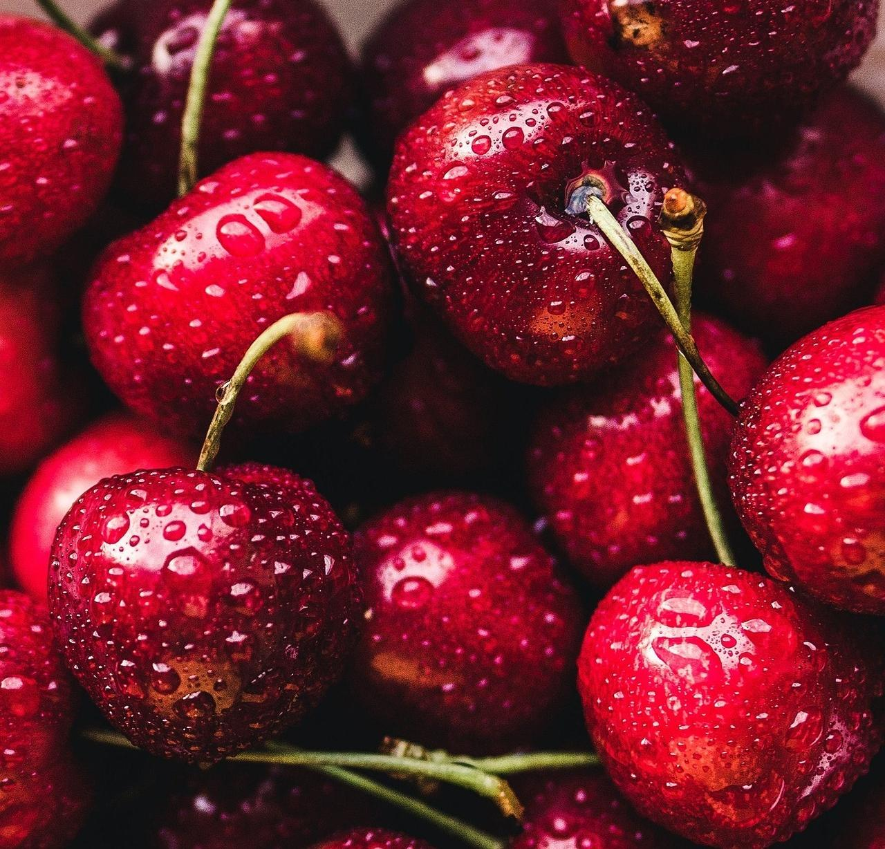

# Немного обо мне

Я прохожу курсы в Нетологии с 2021 года и сейчас я получаю здесь уже вторую новую специальность: тестировщик программного обеспечения. Пока изучное ручное тестирование. В планах продолжить изучение на автоматизатора. И далее — языки программирования.

Некоторые говорят, что такой план не слишком удачный: хочешь быть разработчиком — учись сразу на него:
1. Не трать время.
2. Это разные профессии.
3. Они требуют разного склада ума. 

Ну может быть. 

> Но если вы молоды, вы вряд ли останетесь тестировщиком на всю оставшуюся жизнь в любом случае. И разработка не самый худший вариант для дальнейшего развития.

